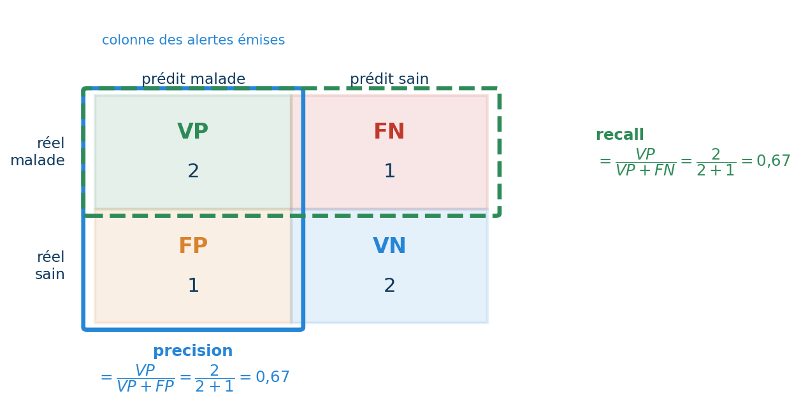
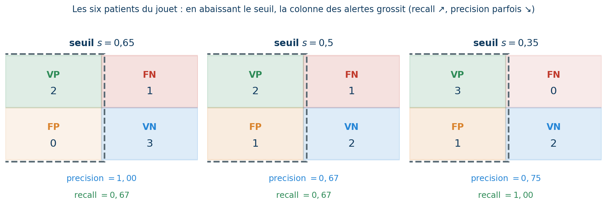

## Objectifs de la séance

::: {.callout-note .ucad-def title="Contenu"}
Cette séance reprend la classification là où les Séances 3 et 5 ont buté : prédire le **paludisme**, présent chez $11{,}8\,\%$ des patients seulement. Elle introduit le bon modèle — la **régression logistique** — et surtout les bons instruments de mesure.
:::

- Transformer un score linéaire en **probabilité** : la sigmoïde, la régression logistique, la **log-loss**.
- Décomposer les erreurs : la **matrice de confusion**, **precision**, **recall**, **F1**.
- Le **seuil** de décision comme curseur — et non comme constante universelle.
- Juger le classement lui-même : la courbe **ROC** construite à la main, l'**AUC**.
- Le **déséquilibre de classes** : pourquoi l'accuracy ment, et quelles métriques disent la vérité.

# Reprendre le problème du paludisme

## Là où la Séance 5 s'est arrêtée

::: {.callout-note .ucad-front title="Le constat du mini-défi"}
La régression linéaire, appliquée à la cible paludisme $\in \{0,1\}$, produit des sorties entre $0{,}008$ et $0{,}248$ — ni bornées, ni interprétables. Seuillées à $0{,}5$ : **zéro positif prédit**, accuracy $0{,}8825$, soit exactement la baseline « personne n'a le paludisme ». L'arbre de la Séance 3 avait échoué au même endroit.
:::

Deux choses manquent : un modèle dont la sortie est une vraie **probabilité** — et des **métriques** capables de voir une classe rare. La séance construit les deux, dans cet ordre.

# La régression logistique

## L'idée : un score linéaire passé au variateur

::: {.callout-note .ucad-front title="Analogie"}
Un variateur de lumière : tourné très à gauche, la pièce est éteinte ; très à droite, pleinement allumée ; entre les deux, toutes les nuances. La régression logistique garde la somme pondérée des Séances 5 — le *score* — et la passe dans un variateur : très négatif $\to$ probabilité proche de $0$, très positif $\to$ proche de $1$, autour de zéro $\to$ la pénombre du doute.
:::

::: {.callout-note .ucad-def title="L'idée en une phrase"}
La **régression logistique** est le modèle linéaire de la Séance 5, suivi d'une fonction qui écrase le score dans $]0,1[$ pour en faire une **probabilité** d'appartenir à la classe $1$.
:::

## La sigmoïde, formellement

::: {.callout-note .ucad-def title="Définition"}
La **sigmoïde** transforme tout réel $z$ en un nombre de $]0,1[$, de façon croissante et symétrique autour de $\sigma(0) = 0{,}5$.
:::

$$ \sigma(z) \;=\; \frac{1}{1 + e^{-z}} $$

(Rappel : $e^{-z}$ est énorme quand $z$ est très négatif, quasi nul quand $z$ est très positif.) Donc $\sigma(z) \to 0$ en $-\infty$, $\to 1$ en $+\infty$ — sans jamais sortir de l'intervalle, contrairement à la droite nue de la Séance 5.


## Exemple — la sigmoïde en chiffres

::: {.callout-tip .ucad-ex title="Cinq scores et leurs probabilités"}
| score $z$ | $-4$ | $-2$ | $0$ | $+2$ | $+4$ |
| --- | --- | --- | --- | --- | --- |
| $\sigma(z)$ | $0{,}018$ | $0{,}119$ | $0{,}500$ | $0{,}881$ | $0{,}982$ |

Deux symétries à retenir : $\sigma(-z) = 1 - \sigma(z)$ (les lignes $-2$ et $+2$ se répondent), et $z = 0$ est l'exact point d'indécision. Quatre unités de score suffisent à passer de « presque sûrement non » à « presque sûrement oui ».
:::

## Le modèle logistique, formellement

::: {.callout-note .ucad-def title="Définition"}
La **régression logistique** prédit la probabilité de la classe $1$ en passant le score linéaire dans la sigmoïde, puis décide en comparant cette probabilité à un **seuil** $s$.
:::

$$ \hat p \;=\; \sigma\big(b + \mathbf{w}\cdot\mathbf{x}\big) \;\in\; ]0,1[\,, \qquad \hat y \;=\; \mathbf{1}\big[\hat p \geq s\big]   (s = 0{,}5 \text{ par défaut}) $$

Mêmes paramètres qu'en Séance 5 — un poids par variable, un intercept — mais la sortie a changé de nature : $\hat p$ est une probabilité, et la *décision* $\hat y$ est une étape séparée, gouvernée par $s$. Cette séparation prédire/décider est le cœur de toute la séance. Malgré son nom, la régression logistique est un modèle de **classification**.

## Exemple — un patient terme à terme

::: {.callout-tip .ucad-ex title="Le modèle du paludisme évalue une patiente"}
Modèle entraîné sur DataSANTÉ-221 (variables *standardisées*, Séance 4) : $b = -2{,}238$ et

|  | âge | glycémie | hémoglobine | fièvre | saison |
| --- | --- | --- | --- | --- | --- |
| poids $w_j$ | $0{,}02$ | $-0{,}10$ | $0{,}04$ | $0{,}12$ | $0{,}75$ |
| $x$ standardisé | $-0{,}17$ | $-1{,}95$ | $1{,}40$ | $0{,}90$ | $1{,}12$ |

$z = -2{,}238 + 0{,}02\!\cdot\!(-0{,}17) - 0{,}10\!\cdot\!(-1{,}95) + 0{,}04\!\cdot\!1{,}40 + 0{,}12\!\cdot\!0{,}90 + 0{,}75\!\cdot\!1{,}12 = \mathbf{-1{,}03}$<br>
$\hat p = \sigma(-1{,}03) = \mathbf{0{,}264}$. À seuil $0{,}5$ : prédiction $\hat y = 0$ — alors que cette patiente *a* le paludisme ($y = 1$). Retenir ce cas : il reviendra.
:::

## Exemple — un second patient, clairement négatif

::: {.callout-tip .ucad-ex title="Un bien-portant de la saison sèche"}
Même modèle, une autre patiente — saison sèche, fièvre basse :

|  | âge | glycémie | hémoglobine | fièvre | saison |
| --- | --- | --- | --- | --- | --- |
| poids $w_j$ | $0{,}02$ | $-0{,}10$ | $0{,}04$ | $0{,}12$ | $0{,}75$ |
| $x$ standardisé | $+0{,}50$ | $+0{,}30$ | $-0{,}50$ | $-1{,}00$ | $-0{,}90$ |

$z = -2{,}238 + 0{,}01 - 0{,}03 - 0{,}02 - 0{,}12 - 0{,}675 = \mathbf{-3{,}07}$, donc $\hat p = \sigma(-3{,}07) = \mathbf{0{,}044}$. Le terme de saison ($-0{,}675$) écrase tous les autres : hors hivernage, le modèle est *confiant* qu'il n'y a pas de paludisme. Décision $\hat y = 0$ à tout seuil raisonnable — et cette fois, à juste titre. Comparé à la patiente précédente ($\hat p = 0{,}264$), on voit le modèle **trier** : il donne bien plus de probabilité aux vrais malades.
:::

## Lire les coefficients : le sens avant tout

::: {.callout-note .ucad-def title="L'idée en une phrase"}
Comme en Séance 5, les poids se lisent — mais sur le **score** $z$, pas sur la probabilité : un $w_j$ positif pousse vers la classe $1$, un $w_j$ négatif l'en éloigne, et la sigmoïde traduit ensuite.
:::

Sur le paludisme (variables standardisées, donc poids comparables) :

- saison des pluies : $w = +0{,}75$ — de très loin le facteur dominant ;
- fièvre : $w = +0{,}12$ — pousse vers le paludisme, modestement ;
- âge, glycémie, hémoglobine : poids quasi nuls — peu informatifs pour *cette* cible.

L'intercept très négatif ($-2{,}24$) encode la rareté de la maladie : sans signal contraire, le modèle part de « probablement pas ». (Lecture experte, en passant : $e^{w_j}$ est le facteur multiplicatif sur la *cote* $\hat p/(1-\hat p)$ — hors programme.)

## Exercice — du score à la décision

::: {.callout-tip .ucad-rec title="Énoncé"}
Un modèle logistique donne, pour trois patients, les scores $z_1 = +2$, $z_2 = 0$ et $z_3 = -4$. Calculer les trois probabilités (table de la sigmoïde) et les décisions au seuil $0{,}5$, puis indiquer le patient pour lequel le modèle est le plus incertain.
:::

::: {.callout-tip .ucad-ex title="Correction"}
$\hat p_1 = \sigma(2) = 0{,}881 \Rightarrow \hat y_1 = 1$ ; $\hat p_2 = \sigma(0) = 0{,}500 \Rightarrow$ pile sur le seuil (convention $\geq$ : $\hat y_2 = 1$) ; $\hat p_3 = \sigma(-4) = 0{,}018 \Rightarrow \hat y_3 = 0$. L'incertitude maximale est au patient $2$ : $\hat p = 0{,}5$ est l'aveu d'ignorance du modèle — l'intérêt d'une sortie probabiliste est précisément de *dire* ce doute.
:::

# Apprendre la logistique : la log-loss

## La log-loss, formellement

::: {.callout-note .ucad-def title="L'idée en une phrase"}
La MSE jugeait des distances ; pour juger des **probabilités**, on fait payer chaque prédiction comme un pari : presque rien si la probabilité était du bon côté, très cher si le modèle était *confiant et faux*.
:::

$$ J(b,\mathbf{w}) \;=\; -\frac{1}{n}\sum_{i=1}^{n}\Big[\, y_i \ln \hat p_i \;+\; (1-y_i)\ln(1-\hat p_i) \,\Big] $$

Pour chaque patient, un seul des deux termes survit : si $y_i = 1$, la perte est $-\ln \hat p_i$ (petite si $\hat p_i$ proche de $1$) ; si $y_i = 0$, c'est $-\ln(1-\hat p_i)$. (Rappel : $-\ln$ de quelque chose proche de $1$ vaut presque $0$ ; proche de $0$, il explose.) C'est la **log-loss**, le critère d'entraînement de la régression logistique — son rôle est celui de la MSE en Séance 5.

## La log-loss, pas à pas sur un seul patient

::: {.callout-tip .ucad-ex title="Quel terme survit ?"}
La formule a deux termes, mais pour chaque patient **un seul compte**. Reprenons la patiente manquée ($\hat p = 0{,}264$, et en réalité $y = 1$) :
$$-\big[\, \underbrace{y\ln \hat p}_{y=1\;:\ \text{ce terme reste}} \;+\; \underbrace{(1-y)\ln(1-\hat p)}_{1-y=0\;:\ \text{ce terme s'éteint}} \,\big] \;=\; -\ln(0{,}264) \;=\; \mathbf{1{,}33}$$
Comme $y = 1$, le facteur $(1-y) = 0$ efface le second terme : il ne reste que $-\ln \hat p$. La perte $1{,}33$ est lourde — le modèle a mis peu de probabilité sur la bonne réponse. S'il avait prédit $\hat p = 0{,}9$, elle tomberait à $-\ln(0{,}9) = 0{,}11$ ; la log-loss *récompense* la probabilité bien placée.
:::

## Exemple — quatre paris chiffrés

::: {.columns}
::: {.column width="46%"}
| $\hat p$ | $y$ | perte |
| --- | --- | --- |
| $0{,}9$ | $1$ | $-\ln 0{,}9 = 0{,}105$ |
| $0{,}5$ | $1$ | $-\ln 0{,}5 = 0{,}693$ |
| $0{,}9$ | $0$ | $-\ln 0{,}1 = 2{,}303$ |
| $0{,}99$ | $0$ | $-\ln 0{,}01 = 4{,}605$ |
:::
::: {.column width="52%"}

:::
:::

La bonne prédiction confiante coûte $0{,}105$ ; la même confiance, mal placée, coûte vingt-deux fois plus — et passer de $0{,}9$ à $0{,}99$ à tort *double* encore la facture. La log-loss enseigne au modèle l'humilité : mieux vaut avouer $0{,}5$ que claironner une erreur.

## Piège — parier 0 ou 1 : la perte infinie

::: {.callout-warning .ucad-piege title="Pourquoi un modèle n'affirme jamais une certitude absolue"}
Prédire $\hat p = 1$ pour un patient finalement négatif coûte $-\ln(1-1) = -\ln 0 = +\infty$. Plus la probabilité s'approche des bords, plus une erreur devient ruineuse : $-\ln(0{,}1) = 2{,}30$, puis $-\ln(0{,}01) = 4{,}61$, puis $-\ln(0{,}001) = 6{,}91$, et ainsi de suite, sans limite.
:::

C'est précisément pour cela que la sigmoïde n'atteint *jamais* exactement $0$ ni $1$ : elle met le modèle à l'abri de la catastrophe. Leçon pratique : une probabilité annoncée « en dur » à $0$ ou $1$ trahit presque toujours un bug (débordement numérique, division) plutôt qu'une vraie certitude — un classifieur sain reste prudent aux extrêmes.

## Pas de solution exacte : la descente, encore

::: {.callout-note .ucad-def title="Ce qui change par rapport à la Séance 5"}
La log-loss n'a **pas d'équation normale** : aucune formule fermée ne donne ses meilleurs poids. Sa cuvette reste une vraie cuvette (un seul creux) — la **descente de gradient** de la Séance 5 s'applique donc telle quelle, et c'est ainsi que `LogisticRegression` s'entraîne.
:::

Conséquences pratiques héritées de la Séance 5 :

- `max_iter` plafonne le nombre de pas — l'avertissement `ConvergenceWarning` signifie « la descente n'avait pas fini » : augmenter `max_iter`, et standardiser ;
- la **standardisation** (Séance 4) rend la cuvette ronde : `StandardScaler` *puis* `LogisticRegression`, dans un Pipeline.

## L'aveu — `C`, la régularisation par défaut

::: {.callout-warning .ucad-piege title="Un réglage caché dans les valeurs par défaut"}
`LogisticRegression` applique **d'office** une pénalité Ridge sur ses poids, dosée par `C` $= 1/\alpha$ : *petit* `C` $=$ forte régularisation, *grand* `C` $=$ faible. Le défaut `C`$\,= 1$ n'est pas neutre — c'est un choix.
:::

Sur le paludisme, l'effet est mesurable mais modeste ($5$ variables seulement) : `C`$\,=0{,}001$ écrase le plus grand poids à $0{,}32$ contre $0{,}75$ à `C`$\,=1$, pour une AUC quasi identique. Sur des problèmes plus riches, `C` devient décisif — son réglage *propre* est l'affaire de la Séance 7.

## En pratique : LogisticRegression

```python
from sklearn.pipeline import make_pipeline
from sklearn.preprocessing import StandardScaler
from sklearn.linear_model import LogisticRegression

modele = make_pipeline(StandardScaler(),
                       LogisticRegression(max_iter=1000, random_state=0))
modele.fit(X_train, y_train)
proba = modele.predict_proba(X_test)[:, 1]   # probabilites de la classe 1
y_pred = modele.predict(X_test)              # decision au seuil 0.5
```

Deux sorties, deux usages : `predict_proba` livre $\hat p$ (la matière première de toute la suite), `predict` applique le seuil $0{,}5$ — un raccourci dont la séance va montrer les limites.

## Exercice — la log-loss à la main

::: {.callout-tip .ucad-rec title="Énoncé"}
Un modèle prédit $\hat p = 0{,}8$ pour deux patients. Le premier est réellement positif ($y=1$), le second négatif ($y=0$). Calculer la perte de chacun ($\ln 0{,}8 = -0{,}223$ ; $\ln 0{,}2 = -1{,}609$), puis la log-loss moyenne des deux.
:::

::: {.callout-tip .ucad-ex title="Correction"}
Patient 1 : perte $= -\ln 0{,}8 = \mathbf{0{,}223}$. Patient 2 : perte $= -\ln(1-0{,}8) = -\ln 0{,}2 = \mathbf{1{,}609}$ — sept fois plus cher. Moyenne : $(0{,}223 + 1{,}609)/2 = \mathbf{0{,}916}$. La même probabilité $0{,}8$ est un bon pari sur l'un, une faute lourde sur l'autre : la log-loss juge la prédiction *face à la réalité*, jamais dans l'absolu.
:::

# La matrice de confusion

## L'idée : quatre façons d'avoir raison ou tort

::: {.callout-note .ucad-def title="L'idée en une phrase"}
Une décision binaire face à une réalité binaire ne peut tomber que dans **quatre cases** — deux succès, deux échecs — et ces quatre cases ne se valent pas : manquer un malade et alerter un bien-portant sont deux erreurs très différentes.
:::



## La matrice de confusion, formellement

::: {.callout-note .ucad-def title="Définition"}
La **matrice de confusion** croise réalité et prédiction : **TP** (vrais positifs), **FN** (faux négatifs : malades manqués), **FP** (faux positifs : fausses alertes), **TN** (vrais négatifs). Tout le reste de la séance n'est que des rapports entre ces quatre effectifs.
:::

$$ \text{TP} + \text{FN} = \text{nombre de positifs réels}\,, \qquad \text{TP} + \text{FP} = \text{nombre d'alertes émises} $$

Deux lectures de la même matrice : par *ligne* (la réalité — où sont passés les malades ?) et par *colonne* (la décision — que valent les alertes ?). Attention à la convention de `scikit-learn` : `confusion_matrix` range les lignes par classe croissante, donc TN en haut à gauche.

## Les quatre cases, en clair : quatre histoires

::: {.callout-tip .ucad-ex title="Ce que chaque case signifie pour un patient réel"}
Sur le terrain, à Ziguinchor, les quatre cases sont quatre destins :

- **TP** — un malade alerté, donc *testé et soigné* : la mission réussie.
- **TN** — un bien-portant non alerté : *rassuré* à juste titre, aucune ressource gaspillée.
- **FP** (fausse alerte) — un bien-portant alerté : il passe un test de confirmation *pour rien* — coûteux, mais **récupérable**.
- **FN** (malade manqué) — un malade renvoyé chez lui sans soin : l'erreur la **plus grave**, parfois irréversible.

La leçon centrale de la séance tient là : FP et FN ne pèsent pas le même poids humain. Une métrique qui les *additionne* — comme l'accuracy — efface précisément la distinction qui compte le plus.
:::

## Exemple — le jouet des six patients

::: {.callout-tip .ucad-ex title="Probabilités, décisions, matrice"}
Six patients, leurs probabilités prédites et la réalité — décision au seuil $0{,}5$ :

| patient | $1$ | $2$ | $3$ | $4$ | $5$ | $6$ |
| --- | --- | --- | --- | --- | --- | --- |
| $\hat p_i$ | $0{,}9$ | $0{,}75$ | $0{,}6$ | $0{,}4$ | $0{,}3$ | $0{,}1$ |
| réalité $y_i$ | $1$ | $1$ | $0$ | $1$ | $0$ | $0$ |
| décision $\hat y_i$ | $1$ | $1$ | $1$ | $0$ | $0$ | $0$ |
| case | TP | TP | **FP** | **FN** | TN | TN |

Bilan : TP $= 2$, FP $= 1$, FN $= 1$, TN $= 2$. Le patient $3$ est une fausse alerte ; le patient $4$, un malade manqué. Ce jouet servira jusqu'à la courbe ROC.
:::

## L'accuracy, revisitée

::: {.callout-note .ucad-def title="L'accuracy dans le langage de la matrice"}
L'accuracy de la Séance 3 est la diagonale des succès rapportée au total — elle additionne TP et TN *comme s'ils se valaient*, et ignore la répartition des erreurs.
:::

$$ \text{accuracy} \;=\; \frac{\text{TP} + \text{TN}}{\text{TP} + \text{FP} + \text{FN} + \text{TN}} \;=\; \frac{2+2}{6} \;=\; 0{,}667   \text{(jouet)} $$

Tant que les deux classes pèsent pareil, l'accuracy est un résumé honnête. Mais elle ne distingue pas un modèle qui manque des malades d'un modèle qui multiplie les fausses alertes — et sur une classe rare, elle deviendra carrément **menteuse**. Il faut des métriques qui regardent les cases une à une.

## Precision et recall, formellement

::: {.callout-note .ucad-front title="Analogie"}
Un agent de santé communautaire fait du dépistage à Ziguinchor. Deux questions distinctes jugent son travail : *quand il alerte, a-t-il raison ?* — et *parmi les vrais malades du village, combien en a-t-il retrouvés ?* La première est la **precision**, la seconde le **recall**.
:::

$$ \text{precision} \;=\; \frac{\text{TP}}{\text{TP} + \text{FP}} \qquad\qquad \text{recall} \;=\; \frac{\text{TP}}{\text{TP} + \text{FN}} $$

La precision se lit sur la *colonne* des alertes : la part d'alertes justifiées. Le recall se lit sur la *ligne* des malades : la part de malades retrouvés. Chacune ignore ce que l'autre surveille — c'est ce qui rend leur couple si informatif.

## Où se lisent precision et recall sur la matrice

{fig-alt="Matrice de confusion du jouet : vrais positifs 2, faux négatifs 1, faux positifs 1, vrais négatifs 2. Un cadre bleu entoure la colonne des alertes émises — precision = VP / (VP + FP) = 2/3 = 0,67 — et un cadre vert en tirets entoure la ligne des vrais malades — recall = VP / (VP + FN) = 2/3 = 0,67." width="64%"}

La même matrice, deux lectures. La **precision** (bleu) parcourt la *colonne* des alertes : parmi tous les « malade ! » émis, combien étaient justes. Le **recall** (vert) parcourt la *ligne* des vrais malades : parmi eux, combien ont été retrouvés. La case TP appartient aux *deux* — c'est le succès que precision et recall se disputent. Et chacune ferme les yeux sur une case d'erreur différente : la precision oublie les FN, le recall oublie les FP.

## Exemple — precision et recall du jouet

::: {.callout-tip .ucad-ex title="Sur les six patients"}
Avec TP $= 2$, FP $= 1$, FN $= 1$ :
$$\text{precision} = \frac{2}{2+1} = \mathbf{0{,}667} \qquad \text{recall} = \frac{2}{2+1} = \mathbf{0{,}667}$$
Deux alertes sur trois étaient justifiées ; deux malades sur trois ont été retrouvés. L'égalité est une coïncidence du jouet (FP $=$ FN) — en général les deux divergent, et c'est leur divergence qui raconte le comportement du modèle : beaucoup de FP tirent la precision vers le bas, beaucoup de FN tirent le recall.
:::

## Piège — les deux métriques aux extrêmes

::: {.callout-warning .ucad-piege title="Quand precision et recall se laissent berner"}
**N'alerter personne** (seuil très haut) : la precision vaut $\text{TP}/(\text{TP}+\text{FP}) = 0/0$, *indéfinie* — `scikit-learn` renvoie $0$ assorti d'un avertissement. **Alerter tout le monde** (seuil nul) : le recall vaut $1$ trivialement, mais la precision s'effondre à la prévalence — sur le paludisme, $235/2000 = 0{,}12$. Chaque métrique, prise *seule*, récompense une stratégie absurde.
:::

D'où la règle déjà posée : precision et recall ne se lisent qu'**ensemble** — et la F1, qui les marie par leur moyenne harmonique, refuse qu'on en sacrifie une pour gonfler l'autre.

## La F1, formellement

::: {.callout-note .ucad-def title="Définition"}
La **F1** résume precision et recall en un seul nombre par leur *moyenne harmonique* — une moyenne sévère, qui reste basse dès que *l'une* des deux est basse.
:::

$$ F_1 \;=\; \frac{2\,\cdot\,\text{precision}\,\cdot\,\text{recall}}{\text{precision} + \text{recall}} $$

Jouet : $F_1 = \dfrac{2 \times 0{,}667 \times 0{,}667}{0{,}667 + 0{,}667} = \mathbf{0{,}667}$. Contre-exemple instructif : precision $= 1$ et recall $= 0{,}01$ donnent une moyenne arithmétique flatteuse de $0{,}505$, mais une F1 de $0{,}02$ — la moyenne harmonique refuse qu'une excellente precision *achète* un recall misérable.

## Exercice — une matrice à dépouiller

::: {.callout-tip .ucad-rec title="Énoncé"}
Sur $100$ patients de test : TP $= 8$, FP $= 2$, FN $= 4$, TN $= 86$. Calculer l'accuracy, la precision, le recall et la F1, puis dire en une phrase ce que ce modèle fait bien et ce qu'il fait moins bien.
:::

::: {.callout-tip .ucad-ex title="Correction"}
Accuracy $= 94/100 = \mathbf{0{,}94}$ ; precision $= 8/10 = \mathbf{0{,}80}$ ; recall $= 8/12 = \mathbf{0{,}667}$ ; $F_1 = \dfrac{2\times 0{,}80\times 0{,}667}{0{,}80+0{,}667} = \mathbf{0{,}727}$. Le modèle alerte à bon escient ($80\,\%$ d'alertes justifiées) mais *manque un malade sur trois* — l'accuracy de $0{,}94$, aveuglée par les $86$ TN, ne laissait rien deviner de cette faiblesse.
:::

# Le seuil : un curseur, pas une constante

## Séparer prédire et décider

::: {.callout-note .ucad-def title="L'idée en une phrase"}
Le modèle produit des probabilités ; le **seuil** les transforme en décisions. Le baisser rend le modèle plus alarmiste (recall $\nearrow$, precision $\searrow$) ; le monter, plus prudent. Le seuil n'appartient pas au modèle : il appartient au **problème**.
:::

Le $0{,}5$ par défaut suppose implicitement que les deux erreurs — manquer un malade, alerter un bien-portant — coûtent pareil. En santé publique, c'est presque toujours faux.

## Analogie — le seuil, c'est une molette de sensibilité

::: {.callout-note .ucad-front title="Le détecteur de fumée"}
Un détecteur de fumée possède une molette de sensibilité. Réglée **haut**, l'alarme ne sonne que pour un vrai incendie : presque aucune fausse alerte (precision élevée), mais elle peut *manquer* un départ de feu discret (recall faible). Réglée **bas**, elle sonne au moindre toast grillé : elle ne rate aucun feu (recall élevé) au prix de fausses alertes incessantes (precision basse). La molette ne change pas le *détecteur* — elle choisit le *compromis*.
:::

Le seuil $s$ est exactement cette molette : le modèle et ses probabilités sont fixés, $s$ décide seulement à partir de quelle probabilité on déclenche l'alerte. Le régler, c'est répondre à une question de **coûts** — celui d'un malade manqué contre celui d'une fausse alerte — pas à une question de mathématiques.

## Exemple — le jouet à seuil 0,35

::: {.callout-tip .ucad-ex title="Les mêmes six patients, un autre seuil"}
Au seuil $0{,}35$, le patient $4$ ($\hat p = 0{,}4$) bascule en alerte :

| patient | $1$ | $2$ | $3$ | $4$ | $5$ | $6$ |
| --- | --- | --- | --- | --- | --- | --- |
| $\hat p_i$ | $0{,}9$ | $0{,}75$ | $0{,}6$ | $0{,}4$ | $0{,}3$ | $0{,}1$ |
| réalité $y_i$ | $1$ | $1$ | $0$ | $1$ | $0$ | $0$ |
| décision ($s=0{,}35$) | $1$ | $1$ | $1$ | $1$ | $0$ | $0$ |

TP $= 3$, FP $= 1$, FN $= 0$ : precision $= 3/4 = \mathbf{0{,}75}$, recall $= 3/3 = \mathbf{1{,}0}$. Aucun paramètre du modèle n'a changé — seul le curseur a bougé, et le malade manqué a été rattrapé.
:::

## La matrice se déforme quand le seuil descend

{fig-alt="Les six patients du jouet : en abaissant le seuil, la colonne des alertes grossit, le recall monte et la precision parfois descend. Trois matrices de confusion. Seuil 0,65 : VP 2, FN 1, FP 0, VN 3 ; precision 1,00, recall 0,67. Seuil 0,5 : VP 2, FN 1, FP 1, VN 2 ; precision 0,67, recall 0,67. Seuil 0,35 : VP 3, FN 0, FP 1, VN 2 ; precision 0,75, recall 1,00." width="86%"}

Les mêmes six patients, trois réglages de la molette. À $s = 0{,}65$, seules les deux alertes les plus sûres passent (precision parfaite, un malade manqué) ; en descendant à $0{,}35$, la *colonne des alertes* se remplit : tous les malades sont rattrapés (recall $1{,}0$) au prix d'une fausse alerte. Le modèle reste **identique** — seul le curseur bouge.

## Le paludisme au seuil 0,5 : personne



Sur le test ($2\,000$ patients, $235$ malades), **toutes** les probabilités prédites vivent sous $0{,}29$ : au seuil $0{,}5$, zéro alerte, recall $= 0$, accuracy $= 0{,}8825 =$ la baseline. Le modèle *semble* inutile — mais les malades (rouge) se concentrent à droite des bien-portants : le modèle **sépare**, c'est le seuil qui gaspille.

## Le balayage chiffré

::: {.callout-tip .ucad-ex title="Trois positions du curseur sur le paludisme"}
| seuil | TP | FP | FN | precision | recall | accuracy |
| --- | --- | --- | --- | --- | --- | --- |
| $0{,}5$ | $0$ | $0$ | $235$ | — | $0{,}00$ | $\mathbf{0{,}8825}$ |
| $0{,}2$ | $100$ | $348$ | $135$ | $0{,}223$ | $0{,}426$ | $0{,}7585$ |
| $0{,}15$ | $184$ | $720$ | $51$ | $0{,}204$ | $\mathbf{0{,}783}$ | $0{,}6145$ |

À $0{,}15$, l'agent retrouve $78\,\%$ des malades au prix de $720$ fausses alertes — et l'accuracy *chute*. Si la consigne est « ne pas laisser le paludisme circuler », le « pire » modèle au sens de l'accuracy est de loin le meilleur au sens de la mission.
:::

## La courbe du compromis



Precision et recall en fonction du seuil : tout gain de l'une se paie sur l'autre. Le choix du point de fonctionnement est une décision de santé publique — coût d'un test de confirmation contre coût d'un malade manqué — pas une décision d'algorithme.

## Exercice — precision et recall à deux seuils

::: {.callout-tip .ucad-rec title="Énoncé"}
Six patients, probabilités $\hat p = (0{,}9;\,0{,}7;\,0{,}45;\,0{,}4;\,0{,}35;\,0{,}3)$ et réalités $y = (1;\,0;\,0;\,1;\,0;\,0)$. Dresser la matrice de confusion au seuil $0{,}5$, puis au seuil $0{,}35$, et calculer precision et recall pour chacun. Que confirme la comparaison ?
:::

::: {.callout-tip .ucad-ex title="Correction"}
**Seuil $0{,}5$** : alertes sur les patients $1$ et $2$. TP $= 1$ (patient $1$), FP $= 1$ (patient $2$), FN $= 1$ (patient $4$), TN $= 3$ : precision $= 1/2 = \mathbf{0{,}50}$, recall $= 1/2 = \mathbf{0{,}50}$. **Seuil $0{,}35$** : alertes sur les patients $1$ à $5$. TP $= 2$, FP $= 3$, FN $= 0$, TN $= 1$ : precision $= 2/5 = \mathbf{0{,}40}$, recall $= 2/2 = \mathbf{1{,}0}$. Baisser le seuil a rattrapé le malade manqué (recall $0{,}50 \to 1{,}0$) mais multiplié les fausses alertes (precision $0{,}50 \to 0{,}40$) : le compromis, en chiffres.
:::

## Exercice — choisir un seuil

::: {.callout-tip .ucad-rec title="Énoncé"}
Une campagne de dépistage à Kaolack dispose de tests de confirmation bon marché ; l'objectif sanitaire est de ne laisser passer presque aucun cas. Parmi les seuils $0{,}5$, $0{,}2$ et $0{,}15$ du balayage, lequel choisir, et quelle métrique faut-il accepter de sacrifier ?
:::

::: {.callout-tip .ucad-ex title="Correction"}
Seuil $\mathbf{0{,}15}$ : recall $0{,}783$, le seul compatible avec l'objectif « presque aucun cas manqué ». On sacrifie la precision ($0{,}204$ : quatre alertes sur cinq seront infirmées par le test de confirmation — acceptable puisqu'il est bon marché) et l'accuracy ($0{,}61$), qui n'a aucune pertinence ici. La métrique se choisit *avant* le seuil, et toutes deux découlent du contexte.
:::

# ROC et AUC : juger le classement

## L'idée : juger toutes les positions du curseur à la fois

::: {.callout-note .ucad-def title="L'idée en une phrase"}
Plutôt que de juger le modèle *à un seuil*, la courbe **ROC** le juge à *tous* les seuils : elle trace, pendant que le curseur descend, la part de malades retrouvés (TPR $=$ recall) contre la part de bien-portants alertés à tort (FPR).
:::

$$ \text{TPR} \;=\; \frac{\text{TP}}{\text{TP}+\text{FN}} \qquad\qquad \text{FPR} \;=\; \frac{\text{FP}}{\text{FP}+\text{TN}} $$

TPR : le recall, déjà connu. FPR : son symétrique côté sains — la proportion de fausses alertes parmi les bien-portants. Le seuil maximal donne le point $(0,0)$ (aucune alerte) ; le seuil nul, le point $(1,1)$ (tout le monde alerté). Entre les deux, la courbe.

## Le mécanisme — construire la ROC à la main (1/2)

::: {.callout-tip .ucad-ex title="Trier puis descendre le curseur"}
Les six patients du jouet, *triés* par probabilité décroissante ($3$ positifs, $3$ négatifs). On part du seuil le plus haut, puis on l'abaisse juste sous chaque $\hat p$ :

| le seuil passe sous | $y$ du patient | effet | TPR | FPR |
| --- | --- | --- | --- | --- |
| — (départ) | — | aucune alerte | $0/3$ | $0/3$ |
| $0{,}9$ | $1$ | $+1$ TP $\Rightarrow$ **monter** | $1/3$ | $0/3$ |
| $0{,}75$ | $1$ | $+1$ TP $\Rightarrow$ **monter** | $2/3$ | $0/3$ |
| $0{,}6$ | $0$ | $+1$ FP $\Rightarrow$ **aller à droite** | $2/3$ | $1/3$ |
| $0{,}4$ | $1$ | $+1$ TP $\Rightarrow$ **monter** | $3/3$ | $1/3$ |
| $0{,}3$ puis $0{,}1$ | $0$, $0$ | $+2$ FP $\Rightarrow$ **à droite** | $3/3$ | $3/3$ |

La règle tient en une ligne : en descendant la liste triée, chaque **positif fait monter**, chaque **négatif pousse à droite**.
:::

## Le mécanisme — construire la ROC à la main (2/2)



Un modèle parfait monterait tout en haut avant de filer à droite (coin supérieur gauche) ; le hasard suivrait la diagonale. Le jouet ne commet qu'un faux pas : le patient $3$ (sain, $\hat p = 0{,}6$) classé au-dessus du patient $4$ (malade, $\hat p = 0{,}4$).

## Exercice — lire TPR et FPR dans une matrice

::: {.callout-tip .ucad-rec title="Énoncé"}
À un seuil donné, un dépistage produit la matrice : TP $= 30$, FN $= 10$, FP $= 20$, TN $= 140$. Calculer le TPR (le recall) et le FPR, puis situer ce point sur la ROC : plutôt vers le bon coin, ou vers la diagonale ?
:::

::: {.callout-tip .ucad-ex title="Correction"}
TPR $= \dfrac{\text{TP}}{\text{TP}+\text{FN}} = \dfrac{30}{40} = \mathbf{0{,}75}$ : trois malades sur quatre retrouvés. FPR $= \dfrac{\text{FP}}{\text{FP}+\text{TN}} = \dfrac{20}{160} = \mathbf{0{,}125}$ : une fausse alerte pour huit bien-portants. Le point $(0{,}125\,;\,0{,}75)$ est nettement au-dessus de la diagonale (où un tirage au sort donnerait TPR $\approx$ FPR), donc bien orienté vers le coin supérieur gauche : un seuil de fonctionnement honnête.
:::

## L'AUC, formellement

::: {.callout-note .ucad-def title="Définition"}
L'**AUC** (*area under the curve*) est l'aire sous la courbe ROC — et elle possède une lecture probabiliste exacte : c'est la probabilité qu'un malade tiré au hasard reçoive une probabilité *plus élevée* qu'un bien-portant tiré au hasard.
:::

$$ \text{AUC} \;=\; \frac{\text{nombre de paires (positif, négatif) bien ordonnées}}{\text{nombre total de paires}} $$

Jouet : $3 \times 3 = 9$ paires ; une seule est inversée (patient $3$ au-dessus du patient $4$) : AUC $= 8/9 \approx \mathbf{0{,}889}$ — exactement l'aire de l'escalier. Repères : $0{,}5 =$ hasard, $1 =$ classement parfait. L'AUC ne dépend d'**aucun seuil** : elle juge la qualité du *tri*, rien d'autre.

## L'AUC dépliée : les neuf paires du jouet

::: {.callout-tip .ucad-ex title="Compter à la main les paires bien ordonnées"}
« Probabilité de bien ordonner une paire (malade, sain) » se vérifie à la main. Il y a $3$ malades ($\hat p = 0{,}9;\,0{,}75;\,0{,}4$) et $3$ sains ($\hat p = 0{,}6;\,0{,}3;\,0{,}1$), soit $3 \times 3 = 9$ paires. Une paire est *bien classée* (✓) si le malade reçoit la plus forte probabilité :

| malade $\big\backslash$ sain | $0{,}6$ | $0{,}3$ | $0{,}1$ |
| --- | --- | --- | --- |
| $0{,}9$ | ✓ | ✓ | ✓ |
| $0{,}75$ | ✓ | ✓ | ✓ |
| $0{,}4$ | **$\times$** | ✓ | ✓ |

Huit paires sur neuf sont bien ordonnées ; l'unique faute est le malade à $0{,}4$, classé sous le sain à $0{,}6$. AUC $= 8/9 = \mathbf{0{,}889}$ — le même nombre que l'aire de l'escalier, obtenu en *comptant les paires*.
:::

## La ROC du paludisme : le verdict



AUC $= \mathbf{0{,}714}$ : un malade pris au hasard est classé au-dessus d'un bien-portant pris au hasard $71\,\%$ du temps. Le modèle que l'accuracy déclarait inutile classe **nettement mieux que le hasard** : il fallait le juger sur le tri, puis choisir le seuil selon la mission.

## Exercice — lire des AUC

::: {.callout-tip .ucad-rec title="Énoncé"}
Trois modèles de dépistage affichent AUC $= 0{,}50$, AUC $= 0{,}93$ et AUC $= 0{,}30$. Interpréter chacun — y compris le troisième, qui mérite réflexion.
:::

::: {.callout-tip .ucad-ex title="Correction"}
$0{,}50$ : le tri vaut un tirage au sort — modèle sans information. $0{,}93$ : excellent classement, un seuil utile existe sûrement. $0{,}30$ : le modèle classe *systématiquement à l'envers* — pire que le hasard en apparence, mais il suffit d'**inverser ses prédictions** pour obtenir une AUC de $0{,}70$ : un tri constamment faux contient autant d'information qu'un tri constamment juste.
:::

# Le déséquilibre de classes

## La classe rare rend l'accuracy menteuse



Avec $11{,}8\,\%$ de positifs, la baseline « jamais palu » affiche $0{,}8825$ d'accuracy sans rien savoir — un score que la logistique au seuil $0{,}5$ *égale sans le battre*. Le recall démasque tout : $0$ et $0$ pour les deux premiers, $0{,}783$ au seuil $0{,}15$. Règle : sur classe rare, toute accuracy doit être comparée à celle de la baseline majoritaire — et accompagnée du recall.

## Rééquilibrer l'entraînement : class\_weight

::: {.callout-note .ucad-def title="L'idée en une phrase"}
Plutôt que de déplacer le seuil *après* l'entraînement, on peut corriger la log-loss *pendant* : `class_weight='balanced'` fait peser chaque malade autant que les $\approx 7{,}5$ bien-portants qu'il « représente », forçant le modèle à les prendre au sérieux.
:::

::: {.callout-tip .ucad-ex title="Effet chiffré sur le paludisme"}
Avec `class_weight='balanced'` (seuil $0{,}5$ inchangé) : TP $= 187$, FP $= 727$, recall $= \mathbf{0{,}796}$, accuracy $= 0{,}6125$, AUC $= 0{,}715$. Le résultat est quasi identique au seuil $0{,}15$ du modèle standard — deux chemins (repondérer la perte, déplacer le curseur) vers le même compromis, et une AUC inchangée : le *tri* n'a pas bougé, seule la décision.
:::

## Quelle métrique pour quelle mission

::: {.callout-important .ucad-ret title="Le bon instrument selon l'objectif"}
- **Dépistage de masse** (manquer un cas coûte cher, confirmer est bon marché) : maximiser le **recall**, surveiller la precision.
- **Action coûteuse par alerte** (hospitalisation, traitement lourd) : privilégier la **precision**.
- **Comparer des modèles** indépendamment du seuil : **AUC** (et log-loss pour la qualité des probabilités).
- **Compromis unique demandé** : **F1**.
- **Accuracy** : seulement si les classes sont équilibrées *et* les erreurs symétriques — sinon, jamais seule.
:::

## Exercice — la bonne métrique selon la mission

::: {.callout-tip .ucad-rec title="Énoncé"}
Associer à chaque situation la métrique à privilégier (recall, precision, AUC ou F1) : **(a)** comparer cinq modèles avant même d'avoir choisi un seuil ; **(b)** déclencher une chimiothérapie lourde et coûteuse sur la seule foi de l'alerte ; **(c)** dépister une épidémie où manquer un cas est dramatique et le test de confirmation est gratuit ; **(d)** rendre un unique chiffre de compromis dans un rapport.
:::

::: {.callout-tip .ucad-ex title="Correction"}
**(a)** **AUC** — elle juge le tri indépendamment du seuil, encore inconnu. **(b)** **precision** — chaque fausse alerte inflige un traitement lourd injustifié ; il faut que les alertes soient sûres. **(c)** **recall** — ne manquer aucun cas prime, et les fausses alertes sont rattrapées gratuitement. **(d)** **F1** — un seul nombre qui refuse de sacrifier l'une des deux. La métrique découle toujours du *coût* des deux erreurs, jamais de l'habitude.
:::

## Piège — régler le seuil sur le jeu de test

::: {.callout-warning .ucad-piege title="Le curseur est un réglage comme un autre"}
Balayer les seuils *sur le test* et garder le meilleur, c'est apprendre du test — la fuite de la Séance 4, déguisée. Le seuil (comme `C`) est un **hyperparamètre** : il se choisit sur des données de *validation*, et le test ne sert qu'une fois, à la toute fin, pour le verdict.
:::

Reste une question que la séance laisse ouverte : comment réserver des données pour ces réglages sans appauvrir l'entraînement ? C'est exactement le problème que résout la **validation croisée** — Séance 7.

# Synthèse

## Le paludisme, enfin : l'arc en trois séances

::: {.callout-tip .ucad-ex title="Trois tentatives, un dénouement"}
| séance | approche | verdict |
| --- | --- | --- |
| S3 | arbre, jugé à l'accuracy | $0{,}8825$ — ne bat pas la baseline |
| S5 | régression linéaire seuillée | $0{,}8825$ — zéro positif prédit |
| **S6** | logistique + bonnes métriques | AUC $\mathbf{0{,}714}$, recall $\mathbf{0{,}78}$ au seuil $0{,}15$ |

La morale n'est pas « la logistique est meilleure que l'arbre » : c'est que les deux premières tentatives étaient jugées par une métrique **aveugle à la classe rare**. Changer d'instrument de mesure a fait apparaître la valeur qui était là.
:::

## Le protocole de classification

::: {.callout-important .ucad-ret title="De bout en bout"}
**1.** Mesurer le déséquilibre (part de positifs) et poser la baseline majoritaire $\to$ **2.** split stratifié $\to$ **3.** Pipeline : `StandardScaler` puis `LogisticRegression` $\to$ **4.** récupérer les **probabilités** (`predict_proba`), pas seulement `predict` $\to$ **5.** AUC pour juger le tri ; matrice de confusion, precision, recall au(x) seuil(s) candidats $\to$ **6.** choisir le seuil selon la *mission* (sur validation, jamais sur test) $\to$ **7.** verdict final sur le test, métriques alignées avec l'objectif.
:::

## À retenir — Séance 6

::: {.callout-important .ucad-ret title="L'essentiel"}
- La régression logistique $=$ le score linéaire de la Séance 5 $+$ la sigmoïde : une vraie **probabilité** en sortie, entraînée par **log-loss** et descente de gradient (pas de solution exacte).
- **Prédire** et **décider** sont deux étapes : le seuil transforme $\hat p$ en $\hat y$, et il appartient au problème, pas au modèle.
- La **matrice de confusion** décompose les erreurs ; **precision** (alertes justifiées) et **recall** (malades retrouvés) se lisent dedans ; la **F1** les résume sévèrement.
- La **ROC** juge tous les seuils à la fois ; l'**AUC** est la probabilité de bien ordonner une paire (malade, sain).
- Sur classe rare, l'**accuracy ment** : toujours la baseline majoritaire en référence, et le recall en regard.
- `C` régularise par défaut ; seuil et `C` sont des **hyperparamètres** — leur réglage propre arrive en Séance 7.
:::

## Pièges fréquents

- Annoncer une accuracy sur classe rare sans la baseline majoritaire en face.
- Confondre precision et recall — l'un juge les *alertes*, l'autre les *malades*.
- Garder le seuil $0{,}5$ par réflexe, comme s'il faisait partie du modèle.
- Régler le seuil (ou `C`) sur le jeu de test : c'est une fuite.
- Lire l'AUC comme une accuracy : elle parle de *paires ordonnées*, pas de décisions.
- Oublier que `LogisticRegression` régularise par défaut (`C`$\,=1$) et exige la standardisation.
- Utiliser `predict` quand l'analyse demande `predict_proba`.

## Prochaine séance

::: {.callout-note .ucad-front title="Séance 7 — Valider et régler sans tricher"}
La séance a laissé deux curseurs en suspens — le seuil et `C` — avec l'interdiction de les régler sur le test. La Séance 7 construit la solution : la **validation croisée**, les **grilles d'hyperparamètres** (`GridSearchCV`), et le protocole complet train / validation / test qui permet de régler sans se mentir.
:::

## Références

- James, Witten, Hastie, Tibshirani — *An Introduction to Statistical Learning*, 2^e^ éd., Springer, 2021.
- Géron — *Hands-On Machine Learning*, 3^e^ éd., O'Reilly, 2022.
- Müller, Guido — *Introduction to Machine Learning with Python*, O'Reilly, 2016.
- Cours : University of Washington CSE 446 ; Stanford CS229.

::: {#ressources-seance}
:::
